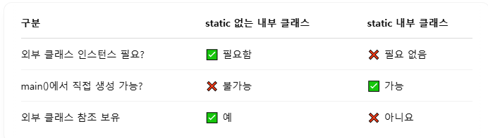

 아래 코드를 작성하는 와중 에러가 발생했다. 

```

public class Abstract_Main {

     class EA extends Example_Abstract{
        public void fn(){
            System.out.println("EA클래스가 추상 메소드를 오버라이딩 하여 구현하였습니다.");
        }

    }

    public static void main(String[] args) throws Exception {
 
        Example_Abstract  a = new EA()  // 에러 발생 
        Example_Abstract b = new B_AbstractClass();
        Example_Abstract c = new C_AbstractClass();
        b.fn();
        c.fn();
    }


}

```


<h1>문제 원인</h1>

**EA클래스가 정적 클래스가 아닌 인스턴스 내부 클래스이고, 내부 클래스를 생성하기 위해서는 바깥 클래스 (Abstract_Main)의 인스턴스가 먼저 있어야 생성할 수 있음.**


<h1>해결 방법 </h1>


# 1번: 예시 외부 클래스에서 접근하는 방법 

 
1. EA 클래스가 정적 클래스가 아닌 인스턴스 내부 클래스이기 때문에, 바깥 클랫의 인스턴스가 있어야 생성할 수 있음 
        
 ```
    // 1 외부 클래스부터 접근 
    Abstract_Main outer = new Abstract_Main();  // 외부 클래스 선언 
    Abstract_Main.EA inner = outer. new EA();  // 내부 클래스 객체 성 및 생성자 호출
    inner.fn(); // inner 변수가 EA 클래스를 참조하기 때문에 fn()메소드 사용 가능 

```

    
# 2번: 예시 static을 선언하여 독립 클래스처럼 동작하게 하여 접근하는 방법

```
public class Abstract_Main {

    static class EA extends Example_Abstract{
        public void fn(){
            System.out.println("EA클래스가 추상 메소드를 오버라이딩 하여 구현하였습니다.");
        }

    }

    public static void main(String[] args) throws Exception {
       


        // 2) EA 클래스에 static을 선언하여 정적 클래스로 변환
        // -> static으로 선언된 내부 클래스는 외부 클래스의 인스턴스와 무관한 독립 클래스이기 때문에 Main에서 외부 인스턴스 없이 호출 가능 

        Example_Abstract a = new EA();
        a.fn();
        Example_Abstract b = new B_AbstractClass();
        Example_Abstract c = new C_AbstractClass();
        b.fn();
        c.fn();
    }
}
```


