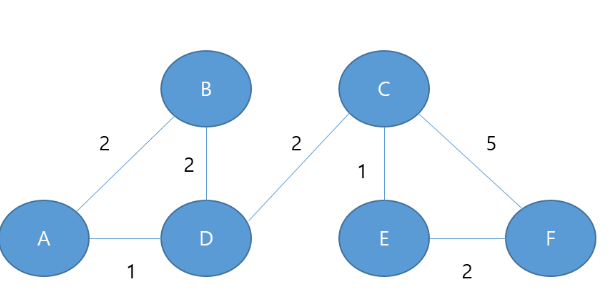

 다음 그림을 바탕으로 RIP,OSPF에 대한 최단 경로 비용을 계산 
 

 1. RIP(Routing Information Protocol)
 **홉 수 를 사용함**
 모든 링크를 같게 취급하여 홉 수가 최소인 경로를 선택한다.
 최대 홉은 15홉까지, 16홉 이상은 도달 불가함

-  거리벡터 알고리즘 

 2. OSPF(Open Shortest Path First)
**링크 비용을 사용함**
각 목적지까지의 누적 비용(홉을 연결하는 실선의 비용)이 최소가 되는 경로를 선택함 

- 다익스트라 알고리즘 -> 최단 경로 트리 생성 

 3. 결론 

 RIP를 적용한다면, **홉 수가 최소**인 경로를 선택하기 때문에 
 A -> D -> C ->F 순으로 움직인다. 

 OSPF를 적용한다면, 각 목적지까지의 **누적 비용이 최소**가 되는 
 A -> D -> C -> E -> F순으로 움직인다. 

