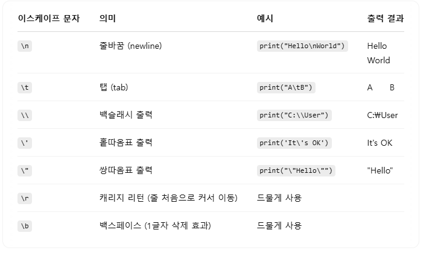

lol=[[1, 2, 3], [4, 5], [6, 7, 8, 9]]
print(lol[0])
print(lol[2][1])
for sub in lol:           # 첫 번째 for문 블록 시작
    for item in sub:      # 두 번째 for문 블록 시작 (첫 번째 안쪽에 존재)
        print(item, end="")   # 이 줄은 두 번째 for문에 속함
    print()               # 이 줄은 첫 번째 for문에 속함

출력 결과 
[1, 2, 3]                   # - lol[0]은 리스트 [1, 2, 3]이므로 출력 시 대괄호([]) 포함됨
7                           # - lol[2][1]은 정수 7이므로 대괄호 없이 7만 출력됨 
123                         # sub의 0번 인덱스 요소를 공백없이 출력 후 print() 적용하여 개행 
45                          # sub의 1번 인덱스 요소를 공백없이 출력 후 print() 적용하여 개행
6789                        # sub의 2번 인덱스 요소를 공백없이 출력 후 print() 적용하여 개행

# --------------------------------------------------------------------

응용 코드 - print(sub)는 리스트 자체를 출력하므로,  대괄호 포함된 상태로 각 줄에 하나씩 출력됨

lol=[[1, 2, 3], [4, 5], [6, 7, 8, 9]]
for sub in lol:         # 첫 번째 for문 블록 시작
    print(sub)           lol
print()                 # 이 줄은 첫 번째 for문에 속함

# 만약 print(sub)라고 가정시 결과값 -> 
[1, 2, 3] 
[4, 5]
[6, 7, 8, 9]

# --------------------------------------------------------------------

파이썬에서는 ""과''가 차이 없음 

class s:
li = ["s", "ke", "in", "da", "dae", "pu" ]
s = so()
str01 = "" >> 공백도 아닌 빈 문자열 
for i in s.li
    str01 = str01 + i[0]
print(str01)

